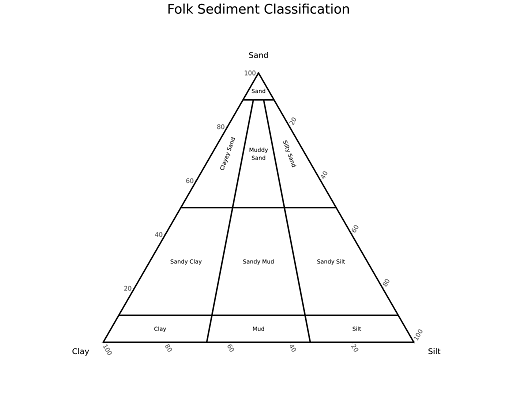

```{r setup, include=FALSE}
knitr::opts_chunk$set(echo = FALSE)

library(readr)
library(knitr)
library(dplyr)
```

<center>
<font size = "6">
Ternary Plots:  
  
  
</font>
</center>

```{r tab1, echo = FALSE, results = 'asis'}
tTern <- read.csv("ternTable.csv")

tTern$Image[1] <- '</img>'
tTern$Image[2] <- '</img>'
tTern$Image[3] <- '</img>'
tTern$Image[4] <- '</img>'
tTern$Image[5] <- '</img>'
tTern$Image[6] <- '</img>'
tTern$Image[7] <- '</img>'
tTern$Image[8] <- '</img>'
tTern$Image[9] <- '</img>'
tTern$Image[10] <- '</img>'
tTern$Image[11] <- '</img>'
tTern$Image[12] <- '</img>'
tTern$Image[13] <- '</img>'
tTern$Image[14] <- '</img>'


tTern <- dplyr::rename(tTern, 'Our Plot Designation' = Our.Plot.Designation, 
                      'Full Plot Name' = Full.Plot.Name, 
                      'Plot Description' = Plot.Description,
                      'Primary Literature' = Primary.Literature
                      )
kable(tTern, rownames = FALSE, options = list(pageLength = 11), align = 'c')
```

<center>
<font size = "6">
Bivariate Plots:  
  
  
</font>
</center>

```{r tab2, echo = FALSE, results = 'asis'}
tBivar <- read.csv("bivarTable.csv")

tBivar$Image[1] <- '</img>'
tBivar$Image[2] <- '</img>'
tBivar$Image[3] <- '</img>'
tBivar$Image[4] <- '</img>'
tBivar$Image[5] <- '</img>'

tBivar <- dplyr::rename(tBivar, 'Our Plot Designation' = Our.Plot.Designation, 
                      'Full Plot Name' = Full.Plot.Name, 
                      'Plot Description' = Plot.Description,
                      'Primary Literature' = Primary.Literature
                      )

kable(tBivar, rownames = FALSE, options = list(pageLength = 11), align = 'c')
```

<center>
<font size = "6">
PT-Meta Plots:  
  
  
</font>
</center>

```{r tab3, echo = FALSE, results = 'asis'}
tMeta <- read.csv("metaTable.csv")

tMeta$Image[1] <- '</img>'
tMeta$Image[2] <- '</img>'
tMeta$Image[3] <- '</img>'
tMeta$Image[4] <- '</img>'
tMeta$Image[5] <- '</img>'
tMeta$Image[6] <- '</img>'
tMeta$Image[7] <- '</img>'
tMeta$Image[8] <- '</img>'
tMeta$Image[9] <- '</img>'
tMeta$Image[10] <- '</img>'
tMeta$Image[11] <- '</img>'
tMeta$Image[12] <- '</img>'
tMeta$Image[13] <- '</img>'
tMeta$Image[14] <- '</img>'
tMeta$Image[15] <- '</img>'
tMeta$Image[16] <- '</img>'


tMeta <- dplyr::rename(tMeta, 'Our Plot Designation' = Our.Plot.Designation, 
                      'Full Plot Name' = Full.Plot.Name, 
                      'Plot Description' = Plot.Description,
                      'Primary Literature' = Primary.Literature
                      )
kable(tMeta, rownames = FALSE, options = list(pageLength = 11), align = 'c')
```
