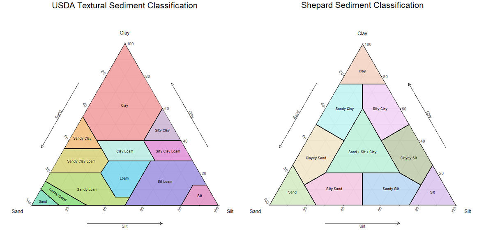

```{r, include=FALSE}
knitr::opts_chunk$set(echo = FALSE, fig.align = "center")

library(gridExtra)
library(ggtern)
library(knitr)
library(png)
library(grid)
```
Ternary diagrams are triangular plots of three variables that sum to a constant, typically 100%. First introduced by <a href="https://en.wikipedia.org/wiki/August_Ferdinand_M%C3%B6bius" target="_blank">August Mobius</a> in 1827, they are sometimes called simplex plots, Gibbs triangles, or de Finetti diagrams. Ternary diagrams are commonly used within the geosciences as classification/discrimination diagrams. 

Below are examples of common ternary diagrams used in the earth sciences: the USDA soils classification diagram and the Sheperd's Sediment classification diagram.

<center>



</center>

Other notable ternary diagrams in the earth sciences include the <a href="https://en.wikipedia.org/wiki/QFL_diagram" target="_blank">QFL diagram</a>, <a href="https://en.wikipedia.org/wiki/QAPF_diagram" target="_blank">QAPF diagram</a>, and a large variety of <a href="https://serc.carleton.edu/research_education/equilibria/ternary_diagrams.html" target="_blank">ternary phase diagrams</a>.

## Plotting Onto a Ternary Diagram
Ternary diagrams make the assumption that the three variables plotted make up 100% of the sample. Before you can plot a data point (say, A = 700, B = 200, and C = 100) you must first normalize that data to 100%. This is done by dividing each value for a point (A, B, and C) by the sum of those values. The generalized equation for this is below:

<center>


</center>

For value A in our example above this becomes:

<center>


</center>
Thus, after normalization the above data point becomes (A = 70, B = 20, C = 10).

Adding a point to a ternary diagram is relatively simple once you get your head around how points move along the axes. Because we plot normalized data onto a ternary plot, all axes are in units of percent (%) and the values range from 0 to 100 (sometimes 0 to 1). The maximum for each ternary axis is located at the triangle node with the axis label. Zero for the any ternary axis is located along the line **opposite the axis label**. So, to move along a ternary axis you start at the line opposite the axis label and then move perpendicularly away from the line toward the axis label.
```{r, fig.height = 3, out.width = '75%'}
p1<- ggtern() +
  theme_light() +
  Tlab("A") +
  Llab("") +
  Rlab("") +
  theme(tern.axis.text.L = element_text(colour = "white")) +
  theme(tern.axis.text.R = element_text(colour = "white")) +
  geom_Tline(Tintercept = c(.2,.4,.6,.8), color = "gray60") +
  geom_Tisoprop(arrow = arrow(ends = "first"), value = 0.5, col = "black", lwd = 2) +
  theme_nogrid()

p2<- ggtern() +
  theme_light() +
  Tlab("") +
  Llab("B") +
  Rlab("") +
  theme(tern.axis.text.T = element_text(colour = "white")) +
  theme(tern.axis.text.R = element_text(colour = "white")) +
  geom_Lline(Lintercept = c(.2,.4,.6,.8), color = "gray60") +
  geom_Lisoprop(arrow = arrow(ends = "first"), value = 0.5, col = "black", lwd = 2) +
  theme_nogrid()

p3<- ggtern() +
  theme_light() +
  Tlab("") +
  Llab("") +
  Rlab("C") +
  theme(tern.axis.text.T = element_text(colour = "white")) +
  theme(tern.axis.text.L = element_text(colour = "white")) +
  geom_Rline(Rintercept = c(.2,.4,.6,.8), color = "gray60") +
  geom_Risoprop(arrow = arrow(ends = "first"), value = 0.5, col = "black", lwd = 2) +
  theme_nogrid()

arrangement <- list(p1, p2, p3)
grid.arrange(grobs = arrangement, layout_matrix = rbind(
               c(1,2,3))
               )
```

Thus, our example point from above (A = 70, B = 20, C = 10) will plot on a ternary diagram like so.

```{r, out.width = '50%'}
data <- data.frame(A = 70, B = 20, C = 10)

ggtern(data = data, aes(x = B, y = A, z = C)) +
  geom_point(size = 5) +
  theme_bvbw() +
  theme_clockwise() +
  theme_showarrows()

```

In practice, you will generally only need two coordinates to find a point location on a ternary plot. This is because ternary points always sum to 100, so after plotting a point on axis A and B, axis C will be solved.

## Pay attention to the axes!

It is important to note the axes of a ternary plot can rotate clockwise or counter-clockwise without changing the position where a point will plot. Only the order of the axes around the triangle controls where a point will plot. For example, the point below does not shift if the axis rotation changes; however, if the arrangement of axes changes, it shifts.

```{r, fig.height = 3, out.width = '75%'}
data <- data.frame(Q = 70, F = 20, L = 10)

p1 <- ggtern(data = data, aes(y = Q, x = F, z = L)) +
  theme_light() +
  geom_point(size = 5) +
  theme_clockwise() +
  theme_showarrows()

p2 <- ggtern(data = data, aes(y = Q, x = F, z = L)) +
  theme_light() +
  geom_point(size = 5) +
  theme_anticlockwise() +
  theme_showarrows()

p3 <- ggtern(data = data, aes(y = F, x = Q, z = L)) +
  theme_light() +
  geom_point(size = 5) +
  theme_clockwise() +
  theme_showarrows()

arrangement <- list(p1, p2, p3)
grid.arrange(grobs = arrangement, layout_matrix = rbind(
               c(1, 2, 3))
               )
```
