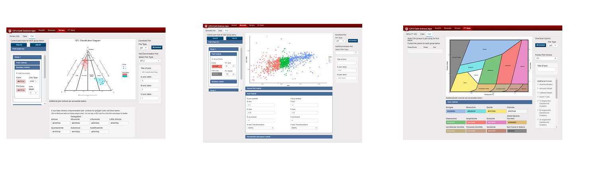

```{r, include=FALSE}
knitr::opts_chunk$set(echo = FALSE, fig.align = "center")

library(gridExtra)
library(ggtern)
library(knitr)
library(png)
library(grid)
```
# How to Build Plots in the RockR! App: 

<div style="display: inline-block; vertical-align:top; text-align:center; width:100%">

</div>

******

### Left side of the page

The left side of the plot in the Ternary, Bivariate, and Metamorphic Facies sections contains specific point control and boundary control options for each group in the data set. If no grouping variable has been identified, the program will default to a single group. 

The point controls allow for the alteration of point color, shape, and size. In the event a point is chose with both a line and fill, those colors can be independently colored. 

The boundary controls have the same aesthetic options as points, but toggling this feature on will show a smoothed area enclosing all the points in the group. This boundary feature is shown in the ternary plot on the left. Use the drop-down menus for the shape and size controls and click in the colored box to choose any color.  
  
### Right side of the page

The right side of the plot in the Ternary, Bivariate, and Metamorphic Facies sections contains the download options, the selection of specific plot base layers, and label options. The Metamorphic Facies section has additional curves and gradients which can be toggled on and off. 

The download options are straightforward. Simply type in your desired file name with the appropriate file extension. This will save the file in the downloads folder of your computer. RockR! recognizes the extensions eps/ps, tex (pictex), pdf, jpeg, tiff, png, bmp, svg and wmf (windows only).

The selection of plot base layers is done with the drop-down menu. For the Ternary section, this list contains classification and discrimination diagrams. These diagrams are visible underneath the selected data sets, and they help with the identification of trends in the data. The Bivariate section offers a variety of Total Alkali Silica (TAS) diagrams for volcanic and plutonic rock data. The selections for the Metamorphic Facies section offer two different accepted variations of the metamorphic facies diagram.

The label options allow the user to alter the axes titles and the main title, all of which update in real time. These fields will have default values unless a plot base layer has been selected. If one has been selected, the fields will be filled appropriately.

The Metamorphic Facies section has additional curves and gradients with checkboxes to their immediate left. These choices apply varied geothermal gradients, mineral phase boundaries, and model pathways on top of the selected metamorphic facies diagram. For TAS diagrams in the Bivariate section, there are additional controls to toggle an alkaline/subalkaline line and rock field names on and off.

### Bottom of the page

Additional plot controls are located below each of the plot types. For all three plot types, if a discrimination plot has been selected, the individual polygon sections can be highlighted with color and transparency choices. 

The ternary plots have general plot control options for visibility of the grid and axis arrows as well as the direction of the axis rotation. 

The Bivariate section offers control over the axes length, incrementation, and axis transformation. The Bivariate section and the Metamorphic Facies sections both have a cursor-dragging zoom functionality. This means that dragging the cursor across the plot will zoom in to that selected window. Double-clicking on the plot will zoom back out to the initial axes values. Changes to the zoom will not affect the chosen plot aesthetics or labels.

******
