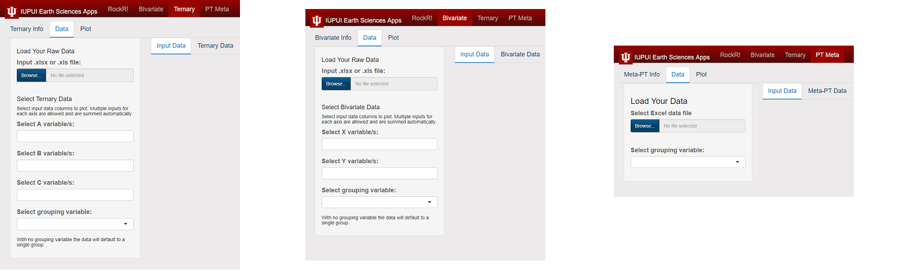
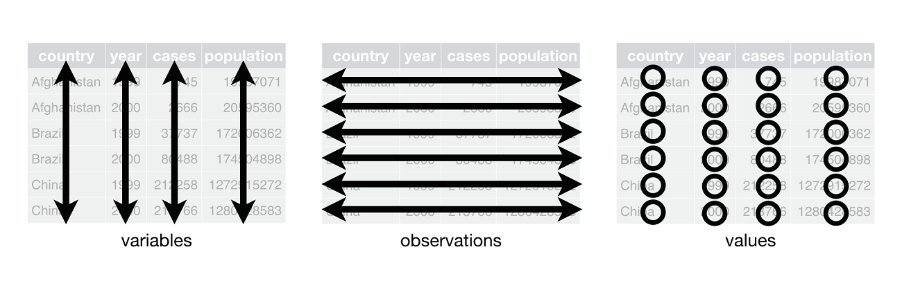

```{r, include=FALSE}
knitr::opts_chunk$set(echo = FALSE, fig.align = "center")

library(gridExtra)
library(ggtern)
library(knitr)
library(png)
library(grid)
library(readxl)
library(kableExtra)
```

# How to Load Data into the RockR! App:  


<div style="display: inline-block; vertical-align:top; text-align:center; width:100%">

</div>

Click on the browse button to select a .csv, .xlsx, or .xls file to load. The "Input Data"" tab and the plot-specific data tab on the right will remain blank until a dataset has been loaded. 

After loading, the "Input Data" tab will populate with the entire data file, though only the first 10 entries (rows) will display by default. This can be adjusted to 25, 50, or 100 entries per page in the drop-down menu under these tabs.

Select the columns to be represented by each variable and then an optional grouping variable can be chosen. The grouping variable can be any column in the data set, and helps organize the data by location, date, or whatever characteristic applies to the data set as a whole. Once the variables have been selected, with or without the optional grouping variable, the plot-specific tab (either Ternary Data, Bivariate Data, or Metamorphic Facies data) will display only the selected data relevant to the plot. For the Bivariate and Metamorphic Facies tabs, this will include the X variable, the Y variable, and the grouping variable (if one was selected). For the Ternary tab, this will include the A variable, the B variable, the C variable, and the grouping variable (if one was selected).

If multiple selections were made for a given variable, this will be shown as an aggregate value.

#Good practices for data organization

Values in the spreadsheet should be only numerical with the exception of column titles and values in a column used for grouping.

Refrain from including hyphens in text values because R interprets a "-" symbol as subtraction instead of a hyphen. This also applies to other common numerical operators.

In a situation where a group variable includes multiple words, separate the words by underscores instead of spaces (i.e. Use "Sample_group" instead of "Sample group").


#Understanding tidy data


RockR! loads data as .xls, .xlsx, or .csv files. Additionally, RockR! expects data to be tidy in its form. Tidy data has rows that represent samples and columns that represent variables. 

<div style="vertical-align:top; text-align:center">

</div>  

Below is a good example of tidy data for a QFL ternary plot. Each variable Qm, F, and Lt are in their own column, and each row is a sample. There is a sample ID column to help keep things straight when visualizing the table, and there is a grouping variable, Location, that lets RockR! easily know which sample is in what group. Grouping variable ID's can be numbers, letters, or words. However, each row from that group needs to be labelled properly. The data does not need to be sorted by group prior to import into RockR!.

```{r, echo = FALSE}
QFL <- read_excel("qfl1.xlsx")
QFL <- rbind(head(QFL, 5), tail(QFL, 5))
QFL <- data.frame(Sample_ID = seq(1:10), QFL)
kable(QFL, "html") %>%
  kable_styling(bootstrap_options = c("striped", "condensed"), full_width = F)

```


A full explanation of the theory behind tidy data by Hadley Wickham is available <a href="http://vita.had.co.nz/papers/tidy-data.pdf" target="_blank">here</a>.

<br>
<hr>


******


<br>